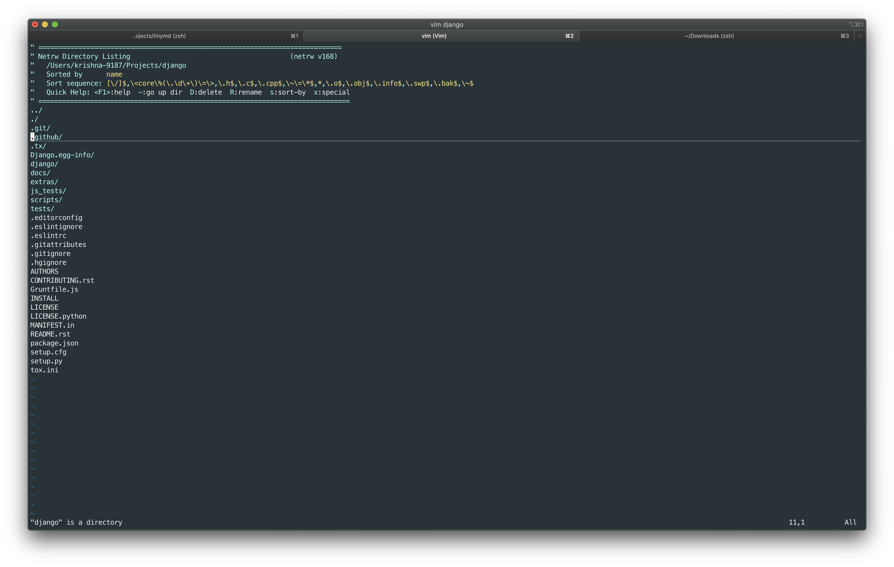

#### How to use vim as a file explorer?

I recently found out Vim can be used to go around folders, and perform operations like rename, delete and sort files like a fully fledged file explorer. Vim is intimidating, especially when you start using it for large projects, I think this feature could bridge the gap a bit.


This feature is also pretty easy to use, just open the folder like you would open a text file with vim.

``` vim <folder-name> ```  


Yes! that is it.

