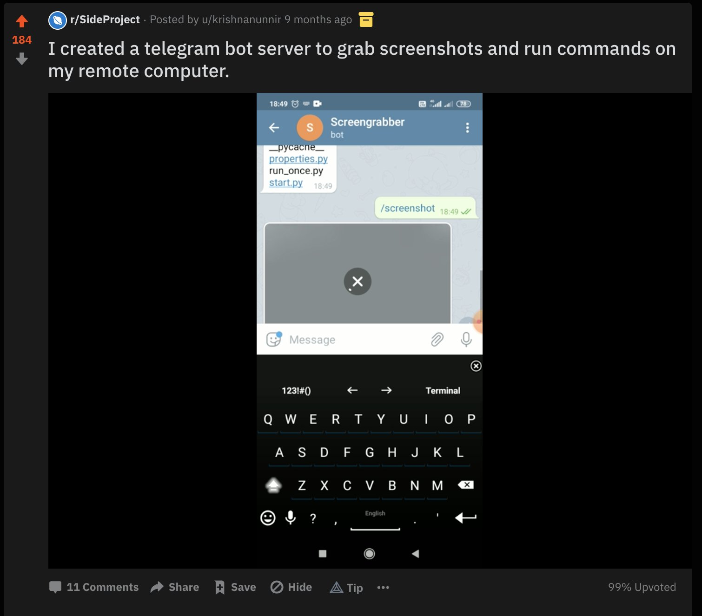
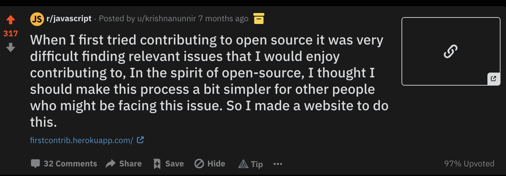
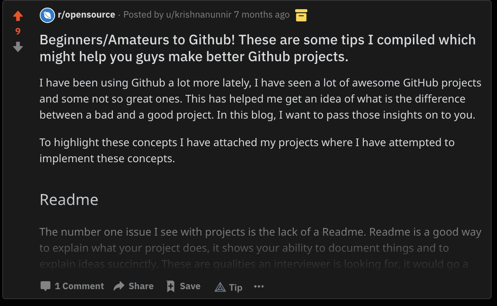
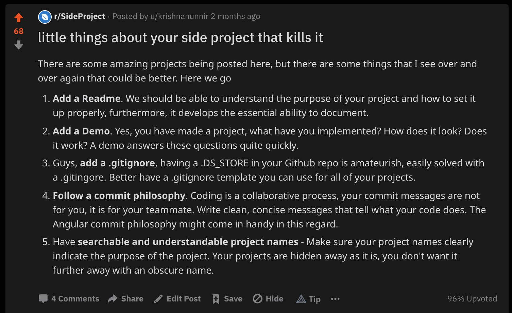
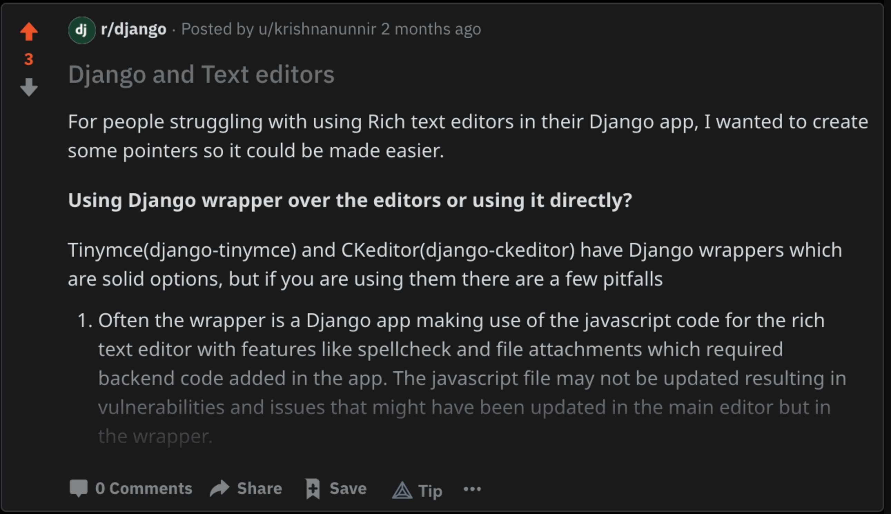

Based on [this](https://twitter.com/bizzaretor/status/1372563104614260738) twitter thread I wrote.

I have been trying to understand what works in Reddit and what doesn't. I have learned a few lessons which I will try to cover in this thread with examples.

Let me get the generic advice out of the way.

1. Your title should be very clear about the value you have to offer or it should be a story about the product you are trying to sell. Reddit hates people selling it stuff, so a better way to go would be showing the value.
2. Choose the right subreddits - your best friends are r/sideprojects, r/coolgithubprojects and product specific subreddits like maybe if its build over Telegram, post it in the telgram subreddit.
3. Smaller subreddits are your best friend, even though the possible numbers are less, it is a good place to validate your idea and find out if your post hits the right note. Also smaller subreddits have higher engagement with your content as they are often a niche.
4. If your project or idea has a novelty element to it, show it through Gifs or videos. A good title with a gif/video is always a hit.
5. Utilize cross-posting - Following the 2nd point, if a smaller subreddit recognizes the value your post has offered to the sub, then you can cross-post to the bigger subreddits with your upvotes from the smaller sub as proof of value.
6. Do not try to sell before convincing them of the value your post offers. Your sales link should ideally be in the comments or in response to enquiries.
7. Posting at the right time. If you are based in India, the perfect time to post would be around 12-2 am. I had the best results in these times. Identify your audience and sell at a time where they are available.
8. No walls of text- this is not a steadfast rule and can be broken as you see fit.

Some of my personal favourites.

Used a gif to show what my product does and r/sideprojects really like novelty products.  

Tells a story that a lot of people might find relatable.

Least favourites

Sounds like I am trying to sell something really hard - and this will put off a lot of people and it was a huge wall of text. Reddit has a very short attention span, so didn't work out.

I did do rewrite for this which worked surprisingly well. 

Why do you think this had more upvotes than the original in a smaller sub.

Another one of my lesser favourites. The title itself doesn't have any value and doesn't tell a story. Its value if any is only recognizable by a very niche of people.

To conclude, you may do everything in this post right, but in the end the algorithm gods might not favour you. So iterate the process until it works.